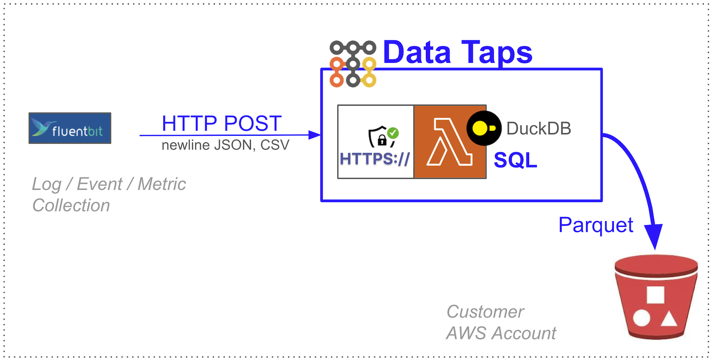

[FluentBit](https://github.com/boilingdata/data-taps-fluentbit-example) | [Web Analytics](https://github.com/boilingdata/data-taps-webanalytics-example) | [PostgreSQL CDC](https://github.com/boilingdata/data-taps-postgres-cdc) | [REST API](https://github.com/boilingdata/data-taps-nycopendata-example) | [OpenSearch/ES](https://github.com/boilingdata/data-taps-opensearch-to-s3)

# FluentBit --> Data Taps --> S3 Parquet

<p align="center">
  
</p>

Our building blocks:

- [collectd](https://www.collectd.org/): _"Systems statistics collection daemon"_
- [fluentbit](https://fluentbit.io/): _"A super fast, lightweight, and highly scalable logging and metrics processor and forwarder. It is the preferred choice for cloud and containerized environments"_
- [Data Taps](https://www.taps.boilingdata.com/): Managed hyper scale HTTP URL for posting newline JSON at any scale, SQL transformation, and landing to S3 with optimal format.

Data Taps makes a perfect end point for colllecting logs, metrics, events etc. efficiently and in scale to S3 -- a single smallest AWS Lambda, so you don't have to worry about clusters or costs. Purely from data storage cost perspective Data Taps is at least 50-80x more cost efficient than Elasticsearch with EBS volumes (assuming EBS is 100% utilised which never is the case of a healthy system, rather closer to 50%). Data Taps brings your data to S3 in de-factor compressed Parquet format, where you want them to land in the end anyway.

## Building Blocks

### 1. collectd

`collectd` daemon with [collectd.conf](collectd.conf) as input source for Fluent Bit client below.

```shell
brew install collectd
```

### 2. FluentBit

Install FluentBit. The [`fluent-bit.yaml`](fluent-bit.yaml) configuration file includes `collectd` input and Data Tap HTTP(s) output with `x-bd-authorization` token.

```shell
brew install fluent-bit
```

### 3. Data Taps

> Data Tap scales enormously as it is a single AWS Lambda function. [A single AWS Lambda function can scale to 1000 instances in 10s - however, it is hard to reach that level due to the efficient data processing with Data Taps](https://boilingdata.medium.com/seriously-can-aws-lambda-take-streaming-data-d69518708fb6). You can ingest GBs of data per second if you need to with unparalleled cost efficiency. Data Taps is 2-50x more cost efficient than e.g. AWS Firehose due to the optimised C++ AWS Lambda runtime and embedded DuckDB streaming SQL engine. It runs with steady latency on the smallest arm64 AWS Lambda, buffers data and outputs periodically to S3 Bucket. Both AWS Lambda and S3 are 1st tier AWS cloud services with built-in High-Availability and high durability (S3).

The Data Tap runs on your AWS Account, whilst BoilingData cloud is used to run analytics over the collected data.

> You can use any data analytics too to read the produced Parquet files partitioned on S3. BoilingData is special in the sense as it is also AWS Lambda serverless.

## Prerequisites

1. You need a Data Tap on your AWS Account. You can follow these instructions.
   https://github.com/boilingdata/data-taps-template/tree/main/aws_sam_template

2. Export fresh Tap token as `TAP_TOKEN` environment variable and `TAP_URL` env var as the Tap ingestion URL endpoint by using [bdcli](https://github.com/boilingdata/boilingdata-bdcli) (see previous step).

```shell
# 1. You will get the TAP URL from the Tap deployment you did in the first step
export TAP_URL='https://...'
# 2a. If you send to your own Data Tap (sharing user is the as your BoilingData username)
export TAP_TOKEN=`bdcli account tap-client-token --disable-spinner | jq -r .bdTapToken`
# 2b. If you send to somebody else's Data Tap, replace "boilingSharingUsername"
export TAP_TOKEN=`bdcli account tap-client-token --sharing-user boilingSharingUsername --disable-spinner | jq -r .bdTapToken`
```

## Start Collecting Statistics

Start collectd. It requires root privileges to collect CPU statistics.

```shell
# 1. start collectd
cp collectd.conf /opt/homebrew/etc/collectd.conf
sudo /opt/homebrew/opt/collectd/sbin/collectd -f -C /opt/homebrew/etc/collectd.conf
# 2. start fluent-bit that gets the collectd statistics and sends to Data Tap
./setup-config.sh # setups fluent-bit.conf
/opt/homebrew/bin/fluent-bit -c fluent-bit.conf
```

## Checking Data

You can check the uploaded Parquet files in your S3 bucket and download them to your local laptop and get a glimpse into them with e.g. [DuckDB](https://duckdb.org/).

```shell
aws s3 sync s3://YOURBUCKET/datataps/ d/
duckdb -s "SELECT COUNT(*) FROM parquet_scan('./d/**/*.parquet');"
```

Alternatively you can run the analytics on the cloud side with BoilingData. For example, a one-off SQL query with bdcli.

```shell
bdcli api query  -s "SELECT COUNT(*) FROM parquet_scan('s3://YOURBUCKET/datataps/');"
```
